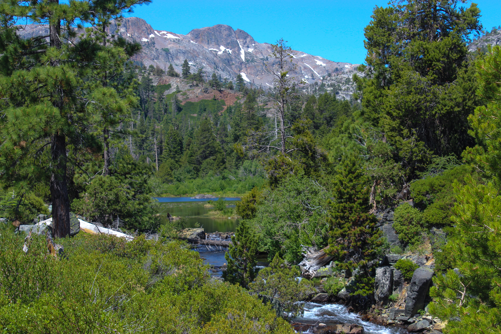

<h1>Questions: </h1> 
 
<h2>(1) How do climatic variables affect viral infection rates and parasitism rates of one species of lepidoptera distributed across an elevational gradient and over time? 

(2) How do climatic variables affect the immune response and chemical sequestration of lepidoptera distributed across an elevational gradient and over time? </h2>

In this project, I will investigate how climatic variables influence sequestration of iridoid glycosides, viral infection prevalence, parasitism rates, and immune function of a native specialist lepidopteran herbivore. I will quantify chemical sequestration, viral infection prevalence, parasitism rates, and immunity of caterpillars from 10 populations of Euphydryas chalcedona feeding on Keckiella breviflora and lemonii, Penstemon newberryi along an elevational gradient (840 - 7,018 ft). I will collect and rear caterpillars from all populations to record parasitoid emergence (e.g. Lespesia archippivora (Tachinidae) and Buathra laborator (Ichneumonidae) have not been described as natural enemies to date). I anticipate using multivariate analyses to find differences in the synergistic effects of iridoid glycosides sequestered by E. chalcedona from their host plants and climactic variables (temperature, precipitation, duration of growing season) on immune system function, viral prevalence, and parasitism rates. This project is in progress.

