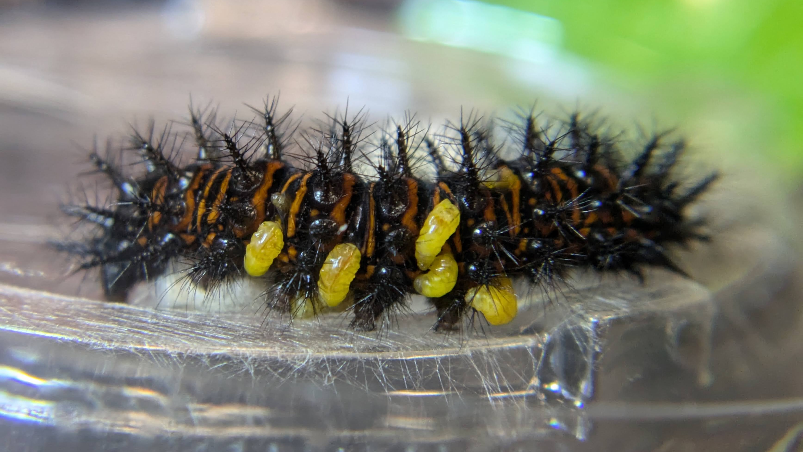

In this project, I investigated the following questions: (1) How does viral infection of a lepidopteran host affect the choice and success of a parasitoid? (2) Are there different effects of viral infection of the host on specialist and generalist parasitoids?

In this project, I investigated how viral infection of a lepidopteran host affects the choice and success of a parasitoid. After rearing out the parasitoid wasp Cotesia euphydryidis from Euphydryas phaeton caterpillars, I allowed the wasps to mate and exposed them to a choice between virus infected and uninfected caterpillars. C. euphydryidis chose virus infected caterpillars (46.9%) over making no choice at all (34.4%) and uninfected caterpillars (18.8%). After overwintering in the caterpillars, the success rate of C. euphydryidis was 55% in the uninfected larvae and 20% in the infected larvae. The choice and success of parasitoid wasps on hosts with varying viral infection status have implications for parasitoid population persistence in the wild. Moving forward, I am interested in understanding if there are different effects of viral infection of the host on specialist and generalist parasitoids. I will repeat these experiments with a generalist tachinid parasitoid in a different system.

