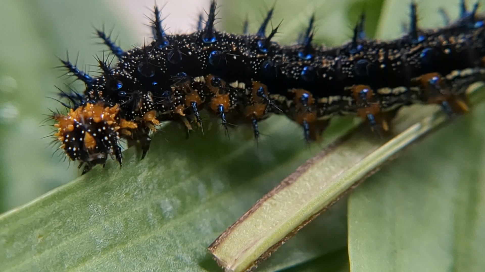

<h1>Questions: </h1> 
 
<h2>
(1) How does a temperature gradient and infection of a pathogen affect the development, survival, and immune response of a lepidopteran herbivore

(2) How does chemistry mediate these effects? 
</h2>

In this project, I investigated the effect of a temperature gradient and infection of a pathogen on the development, survival, and immune response of a lepidopteran herbivore. I conducted a full-factorial experiment with Junonia grisea caterpillars exposed to four different temperature treatments and infected half with a non-lethal dose of the virus, Junonia coenia densovirus. For a subset of caterpillars at sixth instar, I measured viral loads and three different immune parameters: hemocyte counts, phenoloxidase activity, and encapsulation of a filament. In collaboration with Kat Chacon-Godoy, we extracted, isolated, and quantified the iridoid glycosides sequestered by the same subset of caterpillars above. Using Cox proportional hazard curves and Bayesian regressions, I quantified the interactions between temperature, viral infection, development and survival. I used path analyses to understand the interactions between temperature and viral load, immune function, and chemistry.

